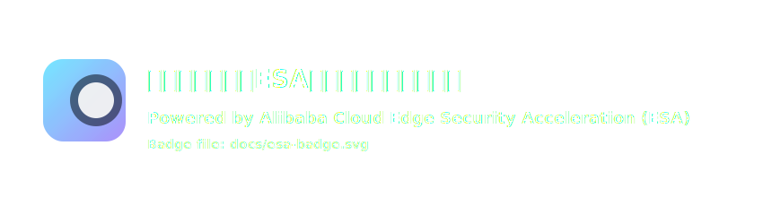

## 宠物生活规划卡（ESA Pages）

一个面向日常养宠场景的轻量应用：输入宠物品种、年龄与健康状况，即可生成「每日喂食 / 运动 / 护理」计划，并附带一张“宠物情绪识别”小知识卡片。页面包含 3D 交互能量球与粒子环特效，强调视觉表现与交互体验，同时用边缘函数提供稳定快速的计划生成接口。

**本项目由阿里云ESA提供加速、计算和保护**



### 作品亮点（给评委看的三维度）

- **创意卓越**：以“能量球 + 粒子环”的 3D 语言表达宠物状态（随年龄/健康变化），将理性计划与感性氛围融合为一张可分享的日常卡片。
- **应用价值**：无需改动即可部署使用，适合普通养宠人每日快速生成参考计划，覆盖喂食/运动/护理/安全观察四个维度。
- **技术探索**：前端静态部署于 Pages；计划生成通过边缘函数 `/api/plan` 就近执行，低延迟、可扩展，并为后续缓存策略与边缘存储扩展预留空间。

### 本地开发

```bash
npm i
npm run dev
```

### 构建与部署（ESA Pages）

- **构建命令**：`npm run build`
- **输出目录**：`dist`
- **边缘函数**：`functions/api/plan.js`（路径：`/api/plan`）

部署完成后，访问站点首页即可使用；表单会请求同域的 `/api/plan` 获取计划结果。

### 目录说明

- `src/pages/App.tsx`：表单、计划卡片与情绪小知识卡片
- `src/scene/*`：Three.js 3D 场景（能量球）与粒子环
- `functions/api/plan.js`：边缘函数（计划生成规则引擎）

### 免责声明

本项目输出为日常参考建议，不替代兽医诊断与处方。若存在明确疾病、用药或急性症状，请优先咨询专业兽医。

